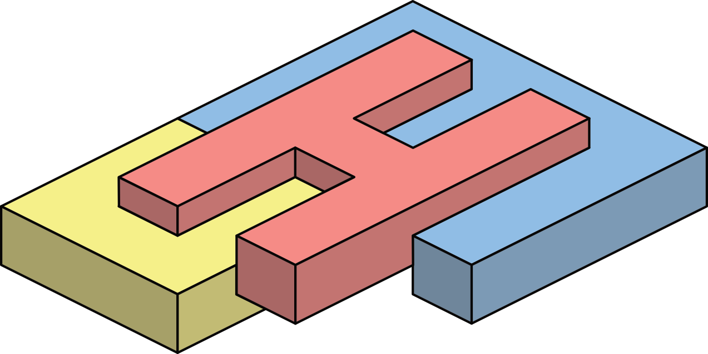

<center>  </center>

# CUSTOMHYS 
**Customising optimisation metaheuristics via hyper-heuristic search**

This project aims to develop an approach based on, but not limited to, Data Science and Optimisation for solving continuous optimisation problems. As a final product, engineers and academicians can dispose of a framework for tailoring metaheuristics for these problems, closely related to practical engineering problems.

## Current data structure

- ```N``` is the number of files within data_files folder
- ```M``` is the number of hyper-heuristic iterations (metaheuristic candidates)
- ```C``` is the number of search operators in the metaheuristic (cardinality)
- ```P``` is the number of control parameters for each search operator
- ```R``` is the number of repetitions performed for each metaheuristic candidate
- ```D``` is the dimensionality of the problem tackled by the metaheuristic candidate
- ```I``` is the number of iterations performed by the metaheuristic candidate
 

- ```search_operator_structure``` corresponds to ```[operator_name = {str}, control_parameters = {dict: P}, selector = {str}]```

```
data_frame = {dict: N}
|-- 'problem' = {list: N}
|  |-- 0 = {str}
:  :
|-- 'dimensions' = {list: N}
|  |-- 0 = {int}
:  :
|-- 'results' = {list: N}
|  |-- 0 = {dict: 6}
|  |  |-- 'iteration' = {list: M}   
|  |  |  |-- 0 = {int}
:  :  :  :
|  |  |-- 'time' = {list: M}
|  |  |  |-- 0 = {float}
:  :  :  :
|  |  |-- 'performance' = {list: M}
|  |  |  |-- 0 = {float}
:  :  :  :
|  |  |-- 'encoded_solution' = {list: M}
|  |  |  |-- 0 = {int}
:  :  :  :
|  |  |-- 'solution' = {list: M}
|  |  |  |-- 0 = {list: C}
|  |  |  |  |-- 0 = {list: 3}
|  |  |  |  |  |-- search_operator_structure
:  :  :  :  :  :
|  |  |-- 'details' = {list: M}
|  |  |  |-- 0 = {dict: 4}
|  |  |  |  |-- 'fitness' = {list: R}
|  |  |  |  |  |-- 0 = {float}
:  :  :  :  :  :
|  |  |  |  |-- 'positions' = {list: R}
|  |  |  |  |  |-- 0 = {list: D}
|  |  |  |  |  |  |-- 0 = {float}
:  :  :  :  :  :  :
|  |  |  |  |-- 'historical' = {list: R}
|  |  |  |  |  |-- 0 = {dict: 5}
|  |  |  |  |  |  |-- 'fitness' = {list: I}
|  |  |  |  |  |  |  |-- 0 = {float}
:  :  :  :  :  :  :  :
|  |  |  |  |  |  |-- 'positions' = {list: I}
|  |  |  |  |  |  |  |-- 0 = {list: D}
|  |  |  |  |  |  |  |  |-- 0 = {float}
:  :  :  :  :  :  :  :  :
|  |  |  |  |  |  |-- 'centroid' = {list: I}
|  |  |  |  |  |  |  |-- 0 = {list: D}
|  |  |  |  |  |  |  |  |-- 0 = {float}
:  :  :  :  :  :  :  :  :
|  |  |  |  |  |  |-- 'radius' = {list: I}
|  |  |  |  |  |  |  |-- 0 = {float}
:  :  :  :  :  :  :  :
|  |  |  |  |  |  |-- 'stagnation' = {list: I}
|  |  |  |  |  |  |  |-- 0 = {int}
:  :  :  :  :  :  :  :
|  |  |  |  |-- 'statistics' = {dict: 10}
|  |  |  |  |  |-- 'nob' = {int}
|  |  |  |  |  |-- 'Min' = {float}
|  |  |  |  |  |-- 'Max' = {float}
|  |  |  |  |  |-- 'Avg' = {float}
|  |  |  |  |  |-- 'Std' = {float}
|  |  |  |  |  |-- 'Skw' = {float}
|  |  |  |  |  |-- 'Kur' = {float}
|  |  |  |  |  |-- 'IQR' = {float}
|  |  |  |  |  |-- 'Med' = {float}
|  |  |  |  |  |-- 'MAD' = {float}
:  :  :  :  :  : 
```

## Publications

[1] [Cruz-Duarte, J.M., Amaya, I., Ortiz-Bayliss, J.C., Connat-Pablos, S.E., and Terashima-Marín, H., A Primary Study on Hyper-Heuristics to Customise Metaheuristics for Continuous Optimisation. Submitted to CEC'2020.](./docfiles/SearchOperators_CEC.pdf)
