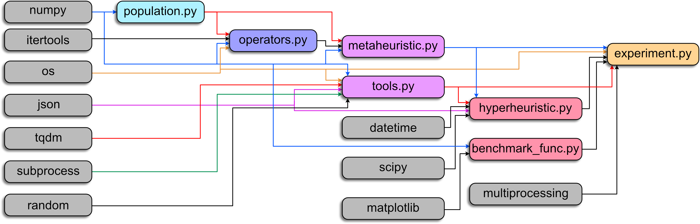

# customhys


**Customising optimisation metaheuristics via hyper-heuristic search** (CUSTOMHyS). This framework provides tools for solving, but not limited to, continuous optimisation problems using a hyper-heuristic approach for customising metaheuristics. Such an approach is powered by a strategy based on Simulated Annealing. Also, several search operators serve as building blocks for tailoring metaheuristics. They were extracted from ten well-known metaheuristics in the literature.

Detailed information about this framework can be found in [1, 2]. Plus, the code for each module is well-documented.

### 🛠 Requirements:
Python 3.7 and higher. Packages: NumPy 1.18.5, SciPy 1.5.0, Matplotlib 3.2.2, json 2.0.9, tqdm 4.47.0.

## 🧰 Modules

The modules that comprise this framework depend on some basic Python packages, as well as they liaise each other. The module dependency diagram is presented as follows:



**NOTE:** Each module is briefly described below. If you require further information, please check the corresponding source code.

### 🤯 Problems (benchmark functions)

This module includes several benchmark functions as classes to be solved by using optimisation techniques. The class structure is based on Keita Tomochika's repository [optimization-evaluation](https://github.com/keit0222/optimization-evaluation).

Source: [``benchmark_func.py``](./benchmark_func.py)

### 👯‍♂️ Population

This module contains the class Population. A Population object corresponds to a set of agents or individuals within a problem domain. These agents themselves do not explore the function landscape, but they know when to update the position according to a selection procedure.

Source: [``population.py``](./population.py)

### 🦾 Search Operators (low-level heuristics)

This module has a collection of search operators (simple heuristics) extracted from several well-known metaheuristics in the literature. Such operators work over a population, i.e., modify the individuals' positions. 

Source: [``operators.py``](./operators.py)

### 🤖 Metaheuristic (mid-level heuristic)

This module contains the Metaheuristic class. A metaheuristic object implements a set of search operators to guide a population in a search procedure within an optimisation problem.

Source: [``metaheuristic.py``](./metaheuristic.py)

### 👽 Hyper-heuristic (high-level heuristic)

This module contains the Hyperheuristic class. Similar to the Metaheuristic class, but in this case, a collection of search operators is required. A hyper-heuristic object searches within the heuristic space to find the sequence that builds the best metaheuristic for a specific problem.

Source: [``hyperheuristic.py``](./hyperheuristic.py)

### 🏭 Experiment

This module contains the Experiment class.  An experiment object can run several hyper-heuristic procedures for a list of optimisation problems.

Source: [``experiment.py``](./experiment.py)

### 🗜️ Tools

This module contains several functions and methods utilised by many modules in this package.

Source: [``tools.py``](./tools.py)

### 💾 Data Structure

The experiments are saved in JSON files. The data structure of a saved file follows a particular scheme described below.

<details>
<summary> Expand structure </summary>
<p>

```
data_frame = {dict: N}
|-- 'problem' = {list: N}
|  |-- 0 = {str}
:  :
|-- 'dimensions' = {list: N}
|  |-- 0 = {int}
:  :
|-- 'results' = {list: N}
|  |-- 0 = {dict: 6}
|  |  |-- 'iteration' = {list: M}   
|  |  |  |-- 0 = {int}
:  :  :  :
|  |  |-- 'time' = {list: M}
|  |  |  |-- 0 = {float}
:  :  :  :
|  |  |-- 'performance' = {list: M}
|  |  |  |-- 0 = {float}
:  :  :  :
|  |  |-- 'encoded_solution' = {list: M}
|  |  |  |-- 0 = {int}
:  :  :  :
|  |  |-- 'solution' = {list: M}
|  |  |  |-- 0 = {list: C}
|  |  |  |  |-- 0 = {list: 3}
|  |  |  |  |  |-- search_operator_structure
:  :  :  :  :  :
|  |  |-- 'details' = {list: M}
|  |  |  |-- 0 = {dict: 4}
|  |  |  |  |-- 'fitness' = {list: R}
|  |  |  |  |  |-- 0 = {float}
:  :  :  :  :  :
|  |  |  |  |-- 'positions' = {list: R}
|  |  |  |  |  |-- 0 = {list: D}
|  |  |  |  |  |  |-- 0 = {float}
:  :  :  :  :  :  :
|  |  |  |  |-- 'historical' = {list: R}
|  |  |  |  |  |-- 0 = {dict: 5}
|  |  |  |  |  |  |-- 'fitness' = {list: I}
|  |  |  |  |  |  |  |-- 0 = {float}
:  :  :  :  :  :  :  :
|  |  |  |  |  |  |-- 'positions' = {list: I}
|  |  |  |  |  |  |  |-- 0 = {list: D}
|  |  |  |  |  |  |  |  |-- 0 = {float}
:  :  :  :  :  :  :  :  :
|  |  |  |  |  |  |-- 'centroid' = {list: I}
|  |  |  |  |  |  |  |-- 0 = {list: D}
|  |  |  |  |  |  |  |  |-- 0 = {float}
:  :  :  :  :  :  :  :  :
|  |  |  |  |  |  |-- 'radius' = {list: I}
|  |  |  |  |  |  |  |-- 0 = {float}
:  :  :  :  :  :  :  :
|  |  |  |  |  |  |-- 'stagnation' = {list: I}
|  |  |  |  |  |  |  |-- 0 = {int}
:  :  :  :  :  :  :  :
|  |  |  |  |-- 'statistics' = {dict: 10}
|  |  |  |  |  |-- 'nob' = {int}
|  |  |  |  |  |-- 'Min' = {float}
|  |  |  |  |  |-- 'Max' = {float}
|  |  |  |  |  |-- 'Avg' = {float}
|  |  |  |  |  |-- 'Std' = {float}
|  |  |  |  |  |-- 'Skw' = {float}
|  |  |  |  |  |-- 'Kur' = {float}
|  |  |  |  |  |-- 'IQR' = {float}
|  |  |  |  |  |-- 'Med' = {float}
|  |  |  |  |  |-- 'MAD' = {float}
:  :  :  :  :  :
```
where:
- ```N``` is the number of files within data_files folder
- ```M``` is the number of hyper-heuristic iterations (metaheuristic candidates)
- ```C``` is the number of search operators in the metaheuristic (cardinality)
- ```P``` is the number of control parameters for each search operator
- ```R``` is the number of repetitions performed for each metaheuristic candidate
- ```D``` is the dimensionality of the problem tackled by the metaheuristic candidate
- ```I``` is the number of iterations performed by the metaheuristic candidate
- ```search_operator_structure``` corresponds to ```[operator_name = {str}, control_parameters = {dict: P}, selector = {str}]```
</p>
</details>

## 🏗️ Work-in-Progress

The following modules are available, but they may do not work. They are currently under developing.

### 🌡️ Characterisation

This module intends to provide metrics for characterising the benchmark functions.

Source: [``characterisation.py``](./characterisation.py)

### 📊 Visualisation

This module intends to provide several tools for plotting results from the experiments.

Source: [``visualisation.py``](./visualisation.py)

## Sponsors

<a href="https://tec.mx/en" target="_blank"></a>
<a href="http://www.cas.cn/" target="_blank"></a>
<a href="https://www.gob.mx/conacyt" target="_blank"></a>

## References

1. [J. M. Cruz-Duarte, I. Amaya, J. C. Ortiz-Bayliss, H. Terashima-Marín, and Y. Shi, CUSTOMHyS: Customising Optimisation Metaheuristics via Hyper-heuristic Search, SoftwareX, vol. 12, p. 100628, 2020.](https://www.sciencedirect.com/science/article/pii/S2352711020303411)
1. [J. M. Cruz-Duarte, I. Amaya, J. C. Ortiz-Bayliss, S. E. Conant-Pablos, H. Terashima-Marín, H., and Y. Shi. _Hyper-Heuristics to Customise Metaheuristics for Continuous Optimisation_, *Swarm and Evolutionary Computation*, 100935.](https://doi.org/10.1016/j.swevo.2021.100935)
1. [Cruz-Duarte, J.M., Amaya, I., Ortiz-Bayliss, J.C., Connat-Pablos, S.E., and Terashima-Marín, H., A Primary Study on Hyper-Heuristics to Customise Metaheuristics for Continuous Optimisation. CEC'2020.](./docfiles/SearchOperators_CEC.pdf)
1. [J. M. Cruz-Duarte, J. C. Ortiz-Bayliss, I. Amaya, Y. Shi, H. Terashima-Marín, and N. Pillay, Towards a Generalised Metaheuristic Model for Continuous Optimisation Problems, Mathematics, vol. 8, no. 11, p. 2046, Nov. 2020.](https://www.mdpi.com/2227-7390/8/11/2046)
1. [J. M. Cruz-Duarte, J. C. Ortiz-Bayliss, I. Amaya, and N. Pillay, _Global Optimisation through Hyper-Heuristics: Unfolding Population-Based Metaheuristics_, *Appl. Sci.*, vol. 11, no. 12, p. 5620, 2021.](http://dx.doi.org/10.3390/app11125620)
