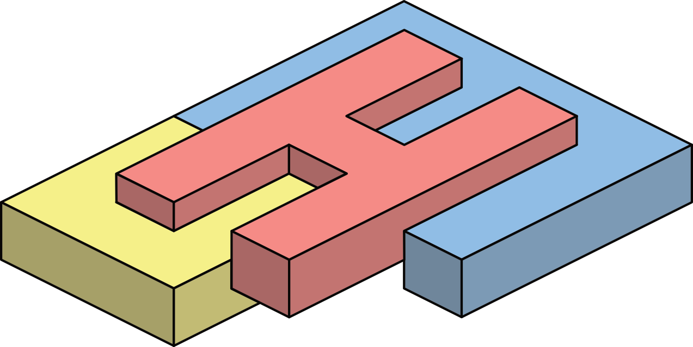

CUSTOMHyS Documentation
=======================

|

**Customising Optimisation Metaheuristics via Hyper-heuristic Search** (CUSTOMHyS)
is a Python framework that provides tools for solving continuous optimisation problems
using a hyper-heuristic approach for customising metaheuristics.

The framework employs a strategy based on Simulated Annealing to search the heuristic
space and build tailored metaheuristics. Several search operators extracted from ten
well-known metaheuristics serve as building blocks for assembling new optimisers.

.. note::

   Detailed information about the theoretical background can be found in the
   :doc:`references` section.

Quick Example
-------------

.. code-block:: python

   from customhys import benchmark_func as bf
   from customhys.metaheuristic import Metaheuristic

   # Define a problem
   problem = bf.Sphere(2)
   prob = {
       "function": problem.get_func_val,
       "is_constrained": True,
       "boundaries": problem.get_search_range(),
   }

   # Define search operators
   search_operators = [
       ("random_search", {"scale": 0.01, "distribution": "uniform"}, "greedy"),
       ("swarm_dynamic", {"self_conf": 2.54, "swarm_conf": 2.56, "version": "inertial", "inertial_weight": 0.7}, "all"),
   ]

   # Create and run the metaheuristic
   mh = Metaheuristic(prob, search_operators, num_agents=30, num_iterations=100)
   mh.run()
   position, fitness = mh.get_solution()
   print(f"Best fitness: {fitness:.6f}")

.. toctree::
   :maxdepth: 2
   :caption: Getting Started

   getting_started
   installation

.. toctree::
   :maxdepth: 2
   :caption: User Guide

   user_guide/index

.. toctree::
   :maxdepth: 2
   :caption: API Reference

   api/index

.. toctree::
   :maxdepth: 1
   :caption: Project

   references
   contributing
   changelog

Indices and tables
==================

* :ref:`genindex`
* :ref:`modindex`
* :ref:`search`
